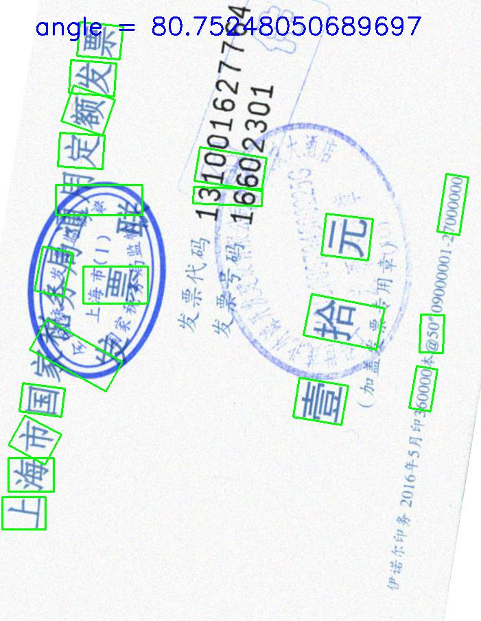

# text-direction-detection

This project aims to detect text detection in images using only image processing techniques with Baidu-OCR (Baidu AI service) and MSER (Maximally Stable Extremal Regions) and SWT (Stroke Width Transform).  And also [Tesseract-OCR](https://opensource.google.com/projects/tesseract.)
tool is used optionally, as assistance to the algorithm.

Baidu AI service to detect text detection (0 90 180 270): https://ai.baidu.com/docs#/OCR-Python-SDK/top 

Please cite original paper:

Özgen, A.C., Fasounaki, M. and Ekenel, H.K., 2018, May. Text detection in natural and computer-generated images. In 2018 26th Signal Processing and Communications Applications Conference (SIU) (pp. 1-4). IEEE.

## INSTALLING

Insall requirements.txt file

`pip install -r requirements.txt`

Or you can create conda environment with 

`conda env create -f requirements.yml`

For OCR assistance, install Tesseract from package manager

`sudo apt install tesseract-ocr`

## USAGE

demo usage is

`mkdir o`

`python text_detect.py -i pic/198.jpg -o o/198.jpg -d both+`

then you can find `o/198.jpg` with the prediction angle in the upper left corner of the picture.

Basic usage is

`python text_detect.py -i <input-image>`

You can give output path

`python text_detect.py -i images/scenetext01.jpg -o <output-image>`

More options available

`python text_detect.py -i images/scenetext01.jpg -o <output-file> -d <light,dark,both,both+> -t`

Option *-i* is image path, *-o* is output path, *-d* is SWT direction (default is `both+`), *-t* option chooses if Tesseract will be used. Normally Tesseract runs poorly if whole image given as input.
But I use it for final decision of bounding boxes and it is not required all the time.

## Sample Results

## REFERENCES

B. Epshtein, E. Ofek, and Y. Wexler. Detecting text in
natural scenes with stroke width transform. In 2010 IEEE
Computer Society Conference on Computer Vision and
Pattern Recognition, pages 2963–2970, June 2010.

Á. González, L. M. Bergasa, J. J. Yebes, and S. Bronte.
Text location in complex images. In Proceedings of the 21st
International Conference on Pattern Recognition
(ICPR2012), pages 617–620, Nov 2012.

Y. Li and H. Lu. Scene text detection via stroke width.
In Proceedings of the 21st International Conference on
Pattern Recognition (ICPR2012), pages 681–684, Nov
2012.